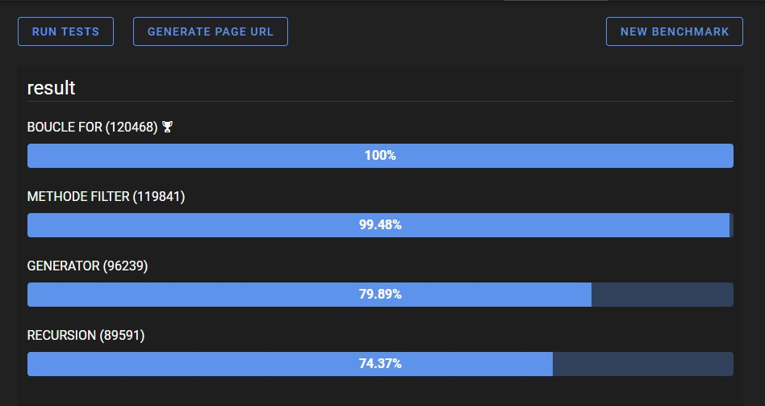

<a name="readme-top"></a>

# Les Petits Plats

#### Site de recettes de cuisine

#### Formation OpenClassrooms

#### Développeur d'applications JavaScript React

#### - Projet 7 -

<p align="right">(<a href="#readme-top">back to top</a>)</p>

## Prerequisites

In order to make the application works on your engine you must have NodeJS and
npm installed.

<p align="right">(<a href="#readme-top">back to top</a>)</p>

## Installation

1. Clone this repository (or download a zip file):
```
$ git clone https://github.com/MichelD-dev/Les-Petits-Plats
```

2. Go to the projet root folder 
```
$ cd Les-Petits-Plats
```

3. Install the dependencies: 
```
$ yarn install
``` 
or 
```
$ npm install
```

4. Install live-server: 
```
$ npm install -g live-server
```
or 
```
$ yarn add -g live-server
```

5. (Optional) Configure the application inside the `.env.local` file
  
6. Launch the application: 
```
$ live-server
```
<p align="right">(<a href="#readme-top">back to top</a>)</p>

## Usage

This repository has 4 available branches, each one corresponding to a different
search implementation:

1. [Recherche_par_boucles_natives](https://github.com/MichelD-dev/Les-Petits-Plats/tree/Recherche_par_boucles_natives)
   (default)
2. [Recherche_par_boucles_fonctionnelles](https://github.com/MichelD-dev/Les-Petits-Plats/tree/Recherche_par_boucles_fonctionnelles)
3. [Recherche_par_récursion](https://github.com/MichelD-dev/Les-Petits-Plats/tree/Recherche_par_r%C3%A9cursion)
4. [Recherche_par_generator](https://github.com/MichelD-dev/Les-Petits-Plats/tree/Recherche_par_generator)

<p align="right">(<a href="#readme-top">back to top</a>)</p>

A benchmark has been made to evaluate the performance of each implementation:



<p align="right">(<a href="#readme-top">back to top</a>)</p>

## Contact:

Michel DELAUNAY - delaunaymichel@hotmail.fr -
https://www.linkedin.com/in/michel-delaunay/  
Project Link: https://micheld-dev.github.io/Les-Petits-Plats

<p align="right">(<a href="#readme-top">back to top</a>)</p>
